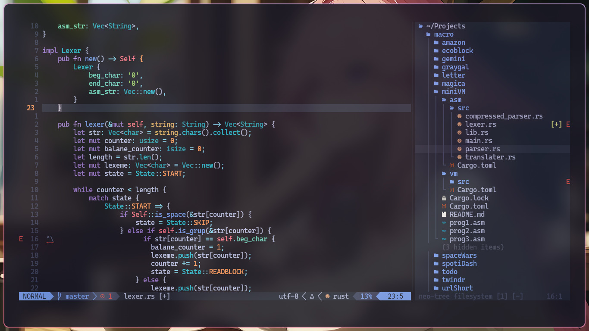

# NEOVIM

my modified [kickstart](https://github.com/nvim-lua/kickstart.nvim.git) neovim config with shell script for setup  and restore (only linux and mac). "dunks on non vim users!"

```bash
chmod -x install.sh
./install.sh
```
---
## preview





---
## plugins

- [autopairs](windwp/nvim-autopairs)
- [colorizer](norcalli/nvim-colorizer.lua)
- [lualine](nvim-lualine/lualine.nvim)
- [nvim-cmp](hrsh7th/nvim-cmp)
- [neo-tree](nvim-neo-tree/neo-tree.nvim)
- [telescope](nvim-telescope/telescope.nvim)
- [treesitter](nvim-treesitter/nvim-treesitter)
- [gitsigns](lewis6991/gitsigns.nvim)
- [leetcode](kawre/leetcode.nvim)
- [themes](folke/tokyonight.nvim)
- [which-key](folke/which-key.nvim)
- [harpoon](theprimeagen/harpoon)
- [lint](mfussenegger/nvim-lint)
- [mini](echasnovski/mini.nvim)
- [preview](adelarsq/image_preview.nvim)
- [dashboard](MeanderingProgrammer/dashboard.nvim)
- [lspconfig](neovim/nvim-lspconfig)
- [tailwind-colorizer](roobert/tailwindcss-colorizer-cmp.nvim)

